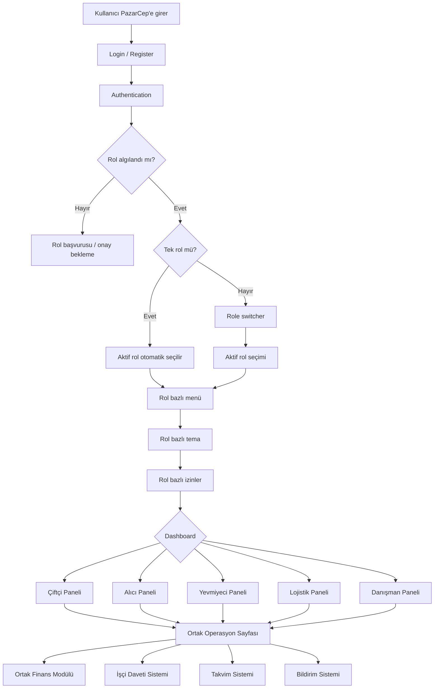

# 00 - Genel Uygulama Rol Akışı

## Amaç

Tüm PazarCep rollerinin login/register, rol algılama, aktif rol seçimi, rol dashboardları ve ortak modüllerle ilişkisini tek görselde göstermek.

## Roller

Çiftçi, Alıcı, Yevmiyeci, Lojistikçi ve Danışman.

## Ana Akış

Kullanıcı PazarCep’e girer, login/register sürecinden geçer, sistem onaylı rolleri algılar. Tek rol varsa ilgili dashboard açılır; çok rol varsa role switcher ile aktif rol seçilir. Aktif rol menüyü, temayı, izinleri ve aksiyonları belirler.

## İlgili Rotalar ve Sayfalar

- `/Auth/LoginBasic`, `/Auth/RegisterBasic`
- `/Panel/Ciftci`, `/Panel/Alici`, `/Panel/Yevmiyeci`, `/Panel/Lojistik`, `/Panel/Danisman`
- `/Panel/Operasyon?role=...`
- `/Panel/*Finans`

## Eksik / Planlanan Parçalar

Kalıcı auth/role store, active role persistence, role-based authorization ve gerçek notification altyapısı henüz production seviyesinde bağlı değildir.

## Mermaid Önizleme

