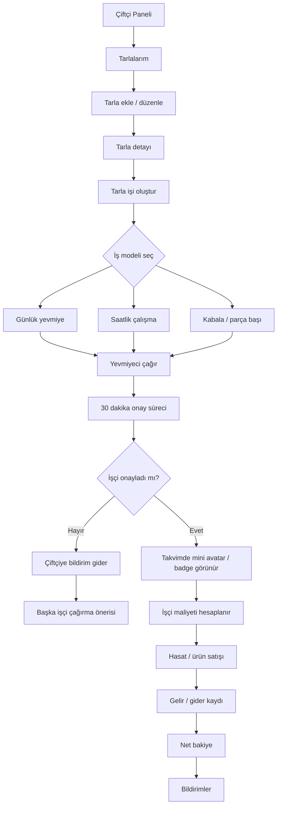

# 01 - Çiftçi / Üreten Rol Akışı

## Amaç

Çiftçinin tarla, tarla işi, yevmiyeci daveti, takvim, hasat ve finans akışını göstermek.

## İlgili Rotalar

- `/Panel/Ciftci`
- `/Panel/CiftciOperasyon`
- `/Panel/CiftciTarlalar`
- `/Panel/CiftciTarlaIsleri`
- `/Panel/CiftciYevmiye`
- `/Panel/CiftciFinans`

## Ana Kararlar

İşçi 30 dakika içinde kabul ederse takvime mini avatar/badge eklenir; onaylamazsa çiftçiye başka işçi çağırma bildirimi gider.

## Eksik / Planlanan Parçalar

Tarla, tarla işi ve işçi daveti kayıtları şu an demo ViewModel seviyesindedir.

## Mermaid Önizleme

