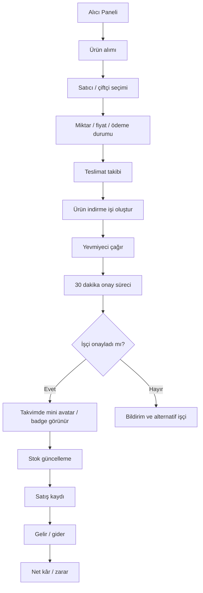

# 02 - Alıcı / Manav / Market / Pazarcı Rol Akışı

## Amaç

Alıcının ürün alımı, teslimat, ürün indirme, işçi daveti, stok ve finans akışını göstermek.

## İlgili Rotalar

- `/Panel/Alici`
- `/Panel/AliciOperasyon`
- `/Panel/AliciAlimlar`
- `/Panel/AliciStok`
- `/Panel/AliciIndirme`
- `/Panel/AliciFinans`

## Ana Kararlar

Ürün indirme işi için yevmiyeci çağrılır. İşçi onayı stok ve operasyon takvimini etkiler.

## Eksik / Planlanan Parçalar

Satın alma, teslimat ve stok hareketleri şu an demo ViewModel seviyesindedir.

## Mermaid Önizleme

