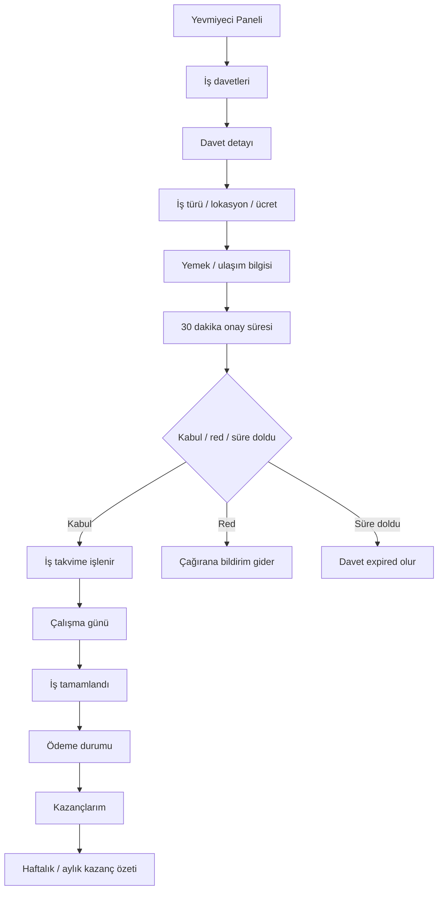

# 03 - Yevmiyeci / İşçi Rol Akışı

## Amaç

İşçinin davetleri görmesi, kabul/red/süre dolumu kararları, takvim ve kazanç akışını göstermek.

## İlgili Rotalar

- `/Panel/Yevmiyeci`
- `/Panel/YevmiyeciOperasyon`
- `/Panel/YevmiyeciDavetler`
- `/Panel/YevmiyeciTakvim`
- `/Panel/YevmiyeciKazanc`

## Ana Kararlar

Davet 30 dakika içinde kabul edilirse takvime işlenir. Red veya süre dolumu davet edene bildirim üretmelidir.

## Eksik / Planlanan Parçalar

Gerçek countdown, kabul/red endpointleri ve ödeme güncelleme altyapısı henüz yoktur.

## Mermaid Önizleme

