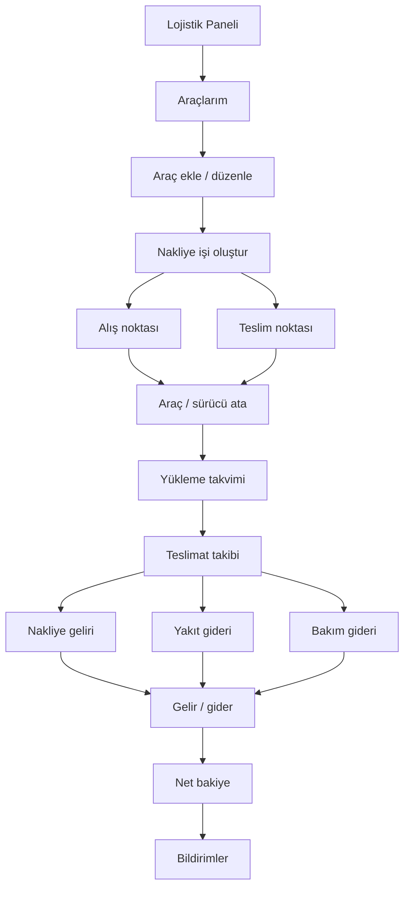

# 04 - Lojistikçi / Nakliyeci Rol Akışı

## Amaç

Araç yönetimi, nakliye işi, yükleme/teslimat takibi ve finans etkisini göstermek.

## İlgili Rotalar

- `/Panel/Lojistik`
- `/Panel/LojistikOperasyon`
- `/Panel/LojistikAraclar`
- `/Panel/LojistikNakliye`
- `/Panel/LojistikFinans`
- `/Lojistik/Filo/Index`

## Eksik / Planlanan Parçalar

Araç ve nakliye kayıtları demo ViewModel seviyesindedir. Harita/rota optimizasyonu yoktur.

## Mermaid Önizleme

