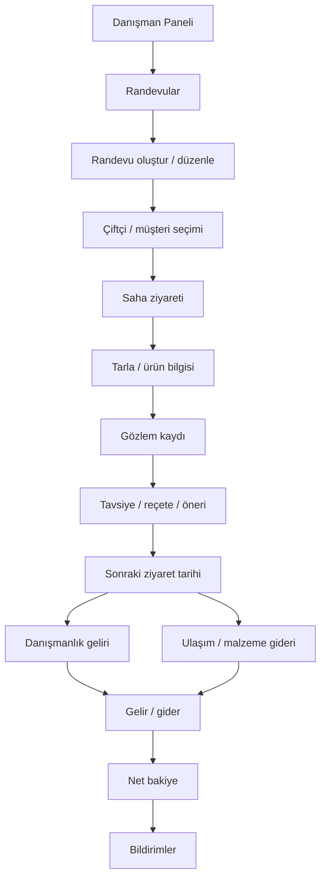

# 05 - Danışman / Ziraat Uzmanı Rol Akışı

## Amaç

Danışmanın randevu, saha ziyareti, gözlem, öneri, rapor ve finans akışını göstermek.

## İlgili Rotalar

- `/Panel/Danisman`
- `/Panel/DanismanOperasyon`
- `/Panel/DanismanRandevular`
- `/Panel/DanismanSaha`
- `/Panel/DanismanFinans`

## Eksik / Planlanan Parçalar

Danışman doğrulaması, rapor ekleri ve kalıcı saha raporu verisi henüz production seviyesinde değildir.

## Mermaid Önizleme

