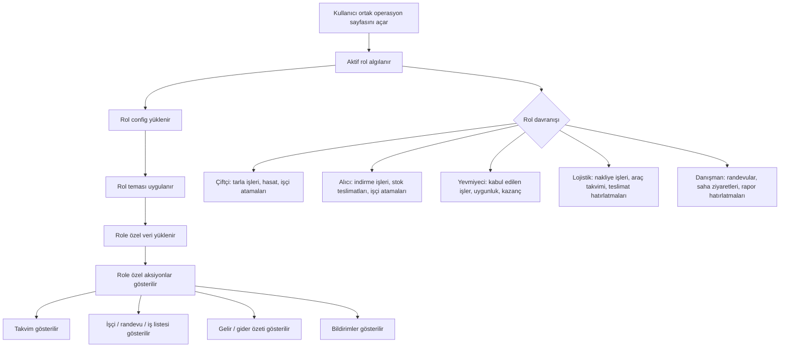

# 06 - Ortak Operasyon Sayfası Akışı

## Amaç

`/Panel/Operasyon?role=...` ve role özel wrapper route’ların aynı sayfayı aktif role göre nasıl değiştirdiğini göstermek.

## İlgili Sayfalar

- `Views/Panel/Operations.cshtml`
- `Models/BusinessPanelViewModels.cs` içindeki `OperationsCalendarViewModel`
- `wwwroot/css/business-panels.css` içindeki role theme sınıfları

## Davranış

Aynı ortak sayfa rol config yükler, tema uygular, role özel aksiyonları ve role özel veri setini render eder.

## Eksik / Planlanan Parçalar

Veri şu an demo factory’den gelir. Üretimde role-aware repository/service katmanı gerekir.

## Mermaid Önizleme

