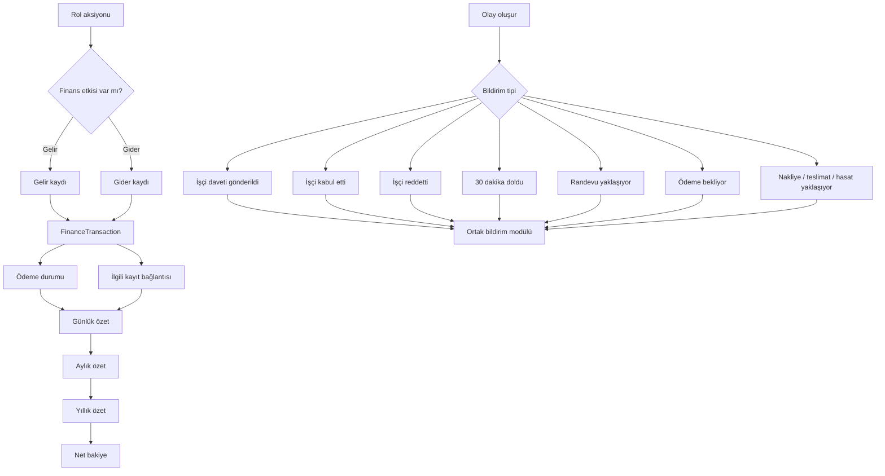

# 07 - Finans ve Bildirim Akışı

## Amaç

Finans ve bildirim modüllerinin tüm rollerde ortak kullanılacağını göstermek.

## İlgili Modeller

- `FinanceTransactionViewModel`
- `WorkerInvitationViewModel`
- `NotificationItemViewModel`

## Eksik / Planlanan Parçalar

Finans ve bildirimler şu an demo ViewModel seviyesindedir. Üretim için kalıcı tablo, servis, background job ve gerçek zamanlı UI güncellemesi önerilir.

## Mermaid Önizleme

